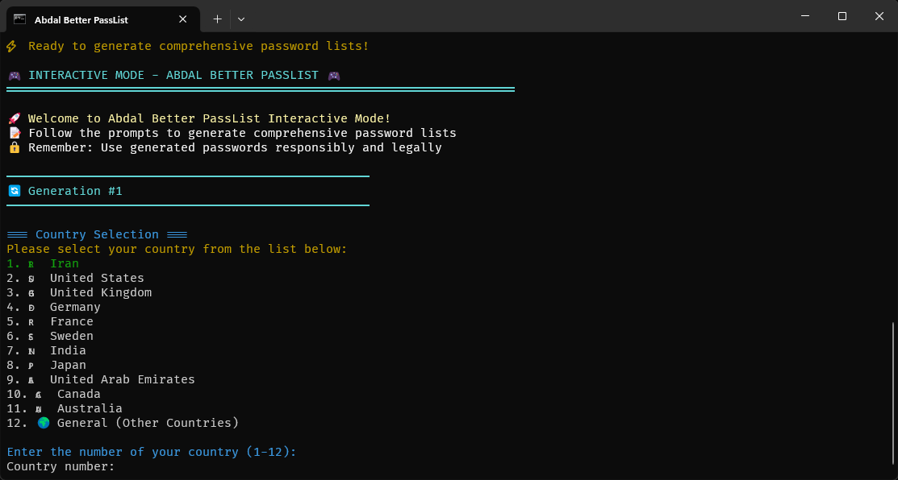

# Abdal Better PassList

<div align="center">
  
</div>

[English](README.md) | **فارسی**

## 🚀 درباره

نرم افزار **Abdal Better PassList** یک نرم افزار بسیار قدرتمندبرای تولید لیست پسورد با استفاده از اطلاعات هویتی افراد است ، این نرم افزار قارد است برای کشور های مختلف با توجه به مدارک و سیستم آن کشور رمز های احتمالی استفاده شده توسط قربانی راتولید کند ، این نرم افزار برای  برای متخصصان امنیت سایبری، تست نفوذ و محققان امنیتی طراحی شده است. این ابزار قدرتمند لیست پسورد هدفمند بر اساس اطلاعات شخصی ایجاد می‌کند و به متخصصان امنیت کمک می‌کند تا رمزهای عبور ضعیف را شناسایی کرده و وضعیت کلی امنیت را بهبود بخشند.

## 🎯 چرا این نرم‌افزار ساخته شد

در چشم‌انداز دیجیتال امروز، رمزهای عبور ضعیف همچنان یکی از مهم‌ترین آسیب‌پذیری‌های امنیتی محسوب می‌شوند. حملات سنتی رمز عبور اغلب شکست می‌خورند زیرا به لیست‌های کلمات عمومی متکی هستند که الگوهای اطلاعات شخصی را در نظر نمی‌گیرند. **Abdal Better PassList** این شکاف را با موارد زیر برطرف می‌کند:

- **هدف‌گیری شخصی‌سازی شده**: لیست‌های رمز عبور بر اساس اطلاعات شخصی خاص تولید می‌کند
- **پشتیبانی چندکشوری**: انواع اسناد و قراردادهای نام‌گذاری از کشورهای مختلف را مدیریت می‌کند
- **ترکیبات هوشمند**: تغییرات واقعی رمز عبور با استفاده از نام‌ها، تاریخ‌ها و اعداد ایجاد می‌کند
- **تولید مقیاس‌پذیر**: سطوح پیچیدگی متعدد برای سناریوهای تست مختلف پشتیبانی می‌کند

## ✨ ویژگی‌ها

### 🌍 پشتیبانی چندکشوری
- **همه کشورها**: ایران، آمریکا، انگلیس، آلمان، فرانسه، سوئد، هند، ژاپن، امارات، کانادا، استرالیا و کشورهای دیگر
- **اسناد خاص کشور**: انواع اسناد منحصر به فرد برای هر کشور را مدیریت می‌کند
- **الگوهای محلی**: قراردادهای نام‌گذاری و فرمت‌های اسناد را درک می‌کند

### 🔐 سه سطح پیچیدگی
- **🟢 عادی**: ترکیبات پایه برای تست سریع
- **🟡 حساس**: ترکیبات کامل برای تحلیل دقیق
- **🔴 خشن**: حداکثر ترکیبات برای پوشش جامع

### ⚡ ویژگی‌های عملکرد
- **پردازش همزمان**: تولید رمز عبور چندنخی (1-16 کارگر)
- **ردیابی پیشرفت**: پیشرفت تولید در زمان واقعی با شاخص‌های بصری
- **بهینه حافظه**: الگوریتم‌های بهینه‌شده برای لیست‌های رمز عبور بزرگ

### 🎮 تجربه کاربری
- **حالت تعاملی**: رابط هدایت شده گام به گام
- **حالت CLI**: رابط خط فرمان برای خودکارسازی
- **رابط کاربری سایبرپانک**: رابط مدرن و رنگی با استایل فسفری
- **ثبت خطا**: سیستم جامع ردیابی و ثبت خطا

### 📁 مدیریت خروجی
- **نام‌گذاری هوشمند**: فایل‌ها با نام `FirstName_LastName_YYYY-MM-DD.txt` نام‌گذاری می‌شوند
- **ذخیره‌سازی منظم**: دایرکتوری‌های خروجی قابل تنظیم
- **جلسات متعدد**: تولید نامحدود لیست رمز عبور در یک جلسه

## 🛠️ ساخت از کد منبع

### پیش‌نیازها
- Go 1.21 یا بالاتر
- ویندوز، لینوکس یا macOS

### ساخت برای پلتفرم‌های مختلف
```bash
./build/build.bat
```

## 📖 نحوه استفاده

### حالت تعاملی
```bash
abdal-better-passlist --interactive
```

### حالت خط فرمان
```bash
# استفاده پایه
abdal-better-passlist --country ir --complexity sensitive --workers 4

# استفاده پیشرفته
abdal-better-passlist --country us --complexity aggressive --workers 8 --output /path/to/output
```

### گزینه‌های موجود
- `--country, -c`: کد کشور (ir, us, uk, de, fr, se, in, jp, ae, ca, au, general)
- `--complexity, -l`: سطح پیچیدگی (normal, sensitive, aggressive)
- `--workers, -w`: تعداد کارگران همزمان (1-16)
- `--output, -o`: دایرکتوری خروجی
- `--interactive, -i`: اجرا در حالت تعاملی

### دستورات
- `test`: تست عملکرد برنامه
- `help-detailed`: نمایش اطلاعات راهنمای جامع

## 🌍 کشورهای پشتیبانی شده

| کشور | کد | اسناد کلیدی |
|------|-----|-------------|
| 🇮🇷 ایران | `ir` | کارت ملی، شناسنامه، پاسپورت، گواهینامه رانندگی |
| 🇺🇸 آمریکا | `us` | گواهینامه رانندگی، SSN، پاسپورت، شناسنامه |
| 🇬🇧 انگلیس | `uk` | پاسپورت، گواهینامه رانندگی، NINO، شناسنامه |
| 🇩🇪 آلمان | `de` | کارت هویت، پاسپورت، شناسه مالیاتی، ثبت‌نام |
| 🇫🇷 فرانسه | `fr` | کارت ملی، پاسپورت، شماره مالیاتی، شناسنامه |
| 🇸🇪 سوئد | `se` | شماره شخصی، کارت هویت، پاسپورت، BankID |
| 🇮🇳 هند | `in` | Aadhaar، PAN، پاسپورت، کارت رای، گواهینامه رانندگی |
| 🇯🇵 ژاپن | `jp` | My Number، پاسپورت، گواهینامه رانندگی، شناسه‌های بازنشستگی |
| 🇦🇪 امارات | `ae` | Emirates ID، پاسپورت، گواهینامه رانندگی، ویزای اقامت |
| 🇨🇦 کانادا | `ca` | گواهینامه رانندگی، SIN، پاسپورت، کارت هویت استانی |
| 🇦🇺 استرالیا | `au` | گواهینامه رانندگی، TFN، کارت Medicare، پاسپورت |
| 🌍 عمومی | `general` | کارت ملی، پاسپورت، شناسه مالیاتی، ثبت‌نام محلی |

## 🔒 امنیت و قانونی

### ⚠️ اخطار مهم
این ابزار برای **اهداف آموزشی** و **تست امنیتی مجاز** طراحی شده است. کاربران باید:

- با قوانین و مقررات محلی مطابقت داشته باشند
- قبل از تست مجوز مناسب دریافت کنند
- مسئولانه و اخلاقی استفاده کنند
- مسئولیت کامل هرگونه سوء استفاده را بپذیرند

### 🛡️ راهنمای استفاده اخلاقی
- فقط سیستم‌هایی را تست کنید که مالک آن‌ها هستید یا مجوز صریح برای تست دارید
- قوانین حریم خصوصی و حفاظت از داده‌ها را رعایت کنید
- از یافته‌ها برای بهبود امنیت استفاده کنید، نه سوء استفاده از آسیب‌پذیری‌ها
- مسائل امنیتی را مسئولانه گزارش دهید

## 🧪 تست

```bash
# تست برنامه
abdal-better-passlist test

# اجرا با حالت تست (رد کردن اخطار)
abdal-better-passlist --test-mode
```

## 📊 مثال‌ها

### مثال 1: حالت تعاملی
```bash
abdal-better-passlist --interactive
```
- انتخاب کشور هدایت شده
- جمع‌آوری اطلاعات گام به گام
- انتخاب پیچیدگی در زمان واقعی
- ردیابی پیشرفت در طول تولید

### مثال 2: تولید با عملکرد بالا
```bash
abdal-better-passlist --country us --complexity aggressive --workers 12 --output /tmp/passwords
```
- حداکثر پیچیدگی برای پوشش جامع
- 12 کارگر همزمان برای سرعت
- دایرکتوری خروجی سفارشی

### مثال 3: تست سریع
```bash
abdal-better-passlist --country ir --complexity normal --workers 4
```
- تولید سریع برای تست اولیه
- پیچیدگی متوسط برای کارایی
- تعداد کارگر استاندارد

 
 
## 🐛 گزارش مشکلات

اگر با مشکلی مواجه شدید یا در پیکربندی مشکل دارید، لطفاً از طریق ایمیل Prof.Shafiei@Gmail.com با ما در تماس باشید. همچنین می‌توانید مشکلات را در GitLab یا GitHub گزارش دهید.

## ❤️ حمایت مالی

اگر این پروژه برای شما مفید بود و مایل به حمایت از توسعه بیشتر هستید، لطفاً در نظر داشته باشید که کمک مالی کنید:
- [اینجا اهدا کنید](https://alphajet.ir/abdal-donation)

## 🤵 برنامه‌نویس

ساخته شده با عشق توسط **ابراهیم شفیعی (EbraSha)**
- **ایمیل**: Prof.Shafiei@Gmail.com
- **تلگرام**: [@ProfShafiei](https://t.me/ProfShafiei)

## 📜 مجوز

این پروژه تحت مجوز GPLv2 or later منتشر شده است.
